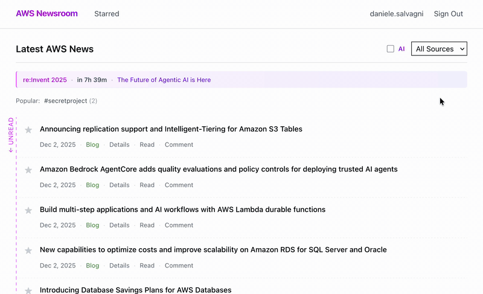

# AWS Newsroom

A serverless, AWS-native platform for collecting AWS news in one place, where
team members can read, rate, comment on, and organize articles using
user-defined tags.



## Why

This project aims to bring a single, shared view of AWS news to a team,
especially during busy periods like the re:Invent season. Different
announcements matter to different teams or projects, and team members often have
insights worth capturing and sharing.

By deploying your own instance on your team's AWS infrastructure, you maintain
full control and ownership of your data and discussions.

## Project Status

⚠️ This is a first release in active development. While the core features are
implemented and functional, expect limitations or occasional extra steps for
version upgrades.

## Architecture

Fully serverless application running on: Amazon API Gateway, AWS Lambda
Functions, Amazon Aurora DSQL, AWS Step Functions, Amazon Cognito, Amazon S3,
Amazon EventBridge. (no diagrams yet)

## Deployment Guide

### Pre-requisites

- AWS CLI
- AWS SAM CLI
- Node.js

### Deployment Steps

1. Check if you are ok with the defaults in `deploy.sh`

2. Minimal configuration using defaults is:

   ```bash
   ALLOWED_EMAIL_DOMAIN=yourcompany.com ./deploy.sh
   ```

3. Initialize the database schema (first-time only):

   ```bash
   export AURORA_ENDPOINT=$(aws cloudformation describe-stacks \
     --stack-name aws-newsroom-prd \
     --region eu-central-1 \
     --query 'Stacks[0].Outputs[?OutputKey==`AuroraEndpoint`].OutputValue' \
     --output text)

   export PGPASSWORD=$(aws dsql generate-db-connect-admin-auth-token \
     --hostname $AURORA_ENDPOINT \
     --region eu-central-1)

   psql -h $AURORA_ENDPOINT -U admin -d postgres -f database/init.sql
   ```

4. Data is automatically ingested every hour. You can trigger ingestion manually
   by invoking the Step Functions state machine from the AWS Console. You can
   use the following payload to ingest the past 2 days of data:

   ```json
   {
     "pastDays": 2
   }
   ```

   To limit the blast radius (costs) in case of bugs or if AWS breaks something
   by changing their APIs, the Lambda function for AI Summary generation has a
   limit of 100 articles per invocation, so past articles will have their
   summaries generated slowly over time unless you manually re-invoke the lambda
   function multiple times manually.

5. Access the frontend using the URL printed at the end of the deployment script
   and sign up using an email address from the allowed domain.

6. (Optional) Events are currently managed manually through
   `database/events.sql`.

## Development

To set up the development environment, run the following commands:

```bash
npm install
```

See `scripts` section in `package.json` for available commands.

## License

This project is licensed under the Apache-2.0 License. See the LICENSE file for
details.
